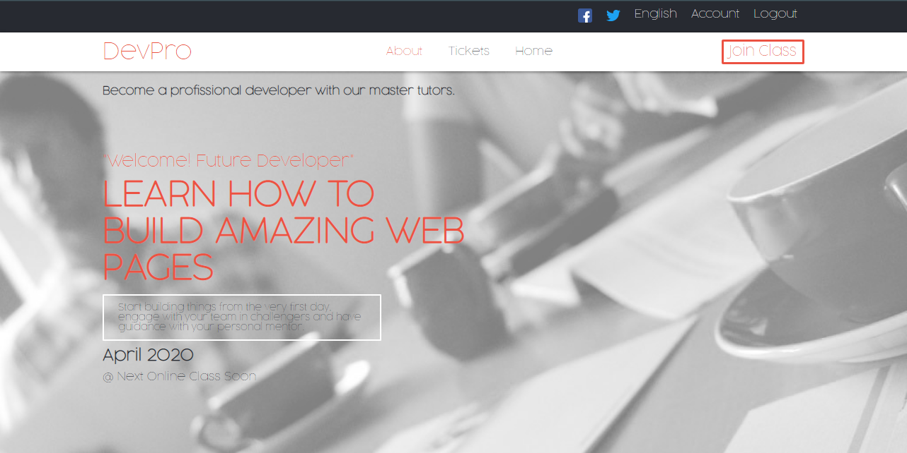
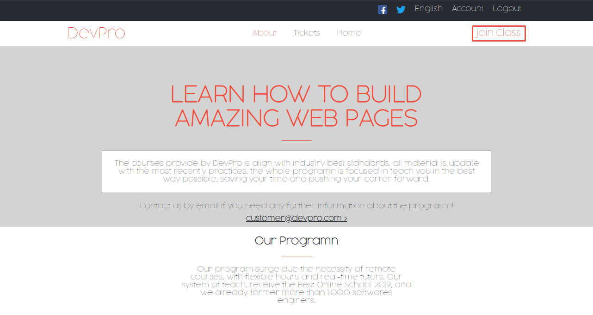
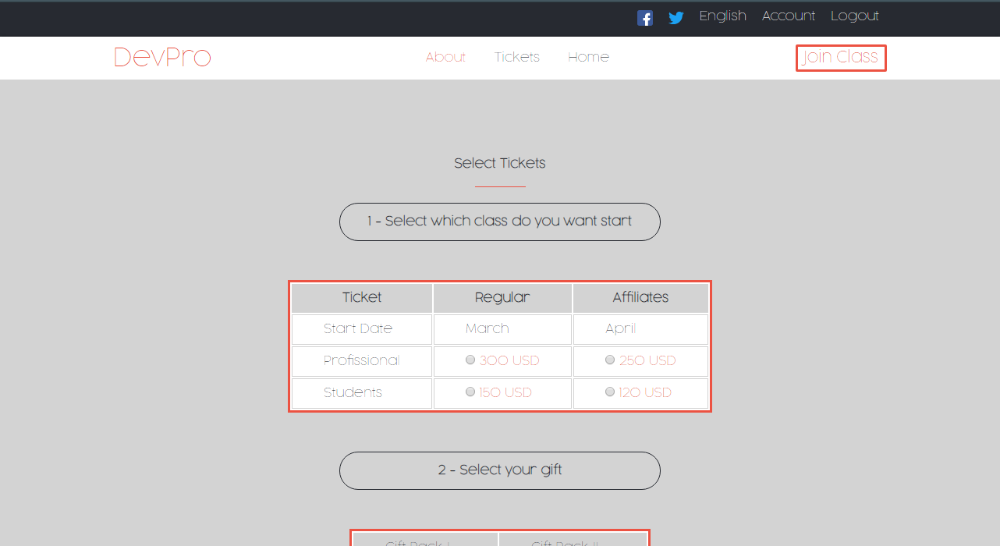

# Course Platform Page

> This project is a web page to land a course platform,
where you can buy tickets for the next online classes.

This is the home page, with a modern and minimalist design.

We have another page about the program, which is very descriptive.

On the last page, you can check out to buy a ticket, with just 3 clicks.

## Requirements

<ul>
  <h3>General</h3>
  <li>Should have the main page with a navbar.</li>
  <li>Should have an about page.</li>
  <li>Should have the tickets page to buy the courses.</li>
  <li>At least two breakpoints, boundaries in 768px.</li>
</ul>

<ul>
  <h3>Specific</h3>
  <li>Use this colors: #272a31, #ec5242 and #d3d3d3</li>
  <li>Typographies: font face, size and weight</li>
  <li>Layout: composition and space between elements, for the 2 given screen sizes</li>
</ul>

## Built With

- Html5 and CSS3  
- Stickler-CI (Linter) and W3C validator  
- Git, Github and VScode  

## Live Demo

[Live Demo Link](https://sevlamare.github.io/CSS-course-platform/)

## Getting Started

To get a local copy up and running follow these steps.

### Prerequisites

If you don't want to follow the commits history, skip these steps 
-Download Git at https://git-scm.com/downloads 
-Make a Github account and set up your SSH key in your current machine. 
-Clone the repository with terminal: 
git clone git@github.com:SevlaMare/mint-sign-up-clone.git

### Setup

Click on the green button on this page (Code) and click on (Download Zip) 
Unzip files. It's ready to use!

### Run

Just drag-drop, the index.html on some web browser, like Google Chrome.

## Author

👤 **Thiago Miranda**

- Github: [@SevlaMare](https://github.com/SevlaMare)
- Twitter: [#SevlaMare)](https://twitter.com/SevlaMare)
- Linkedin: [SevlaMare)](https://www.linkedin.com/in/sevlamare)

## 🤝 Contributing

Contributions, issues and feature requests are welcome!

Feel free to check the [issues page](issues/).

## Show your support

Give a ⭐️ if you like this project!

## Acknowledgments

- A special thanks to the code reviewers.

## 📝 License

Design idea by <a href="https://www.behance.net/adagio07">Cindy Shin in Behance</a>

<strong>Creative Commons</strong>
